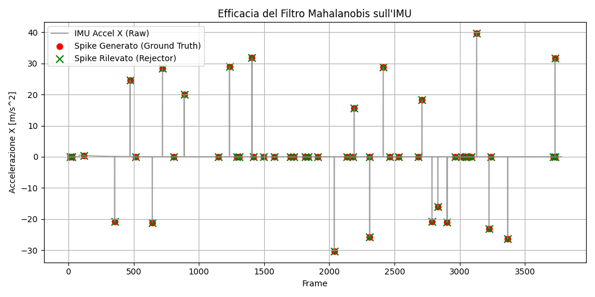
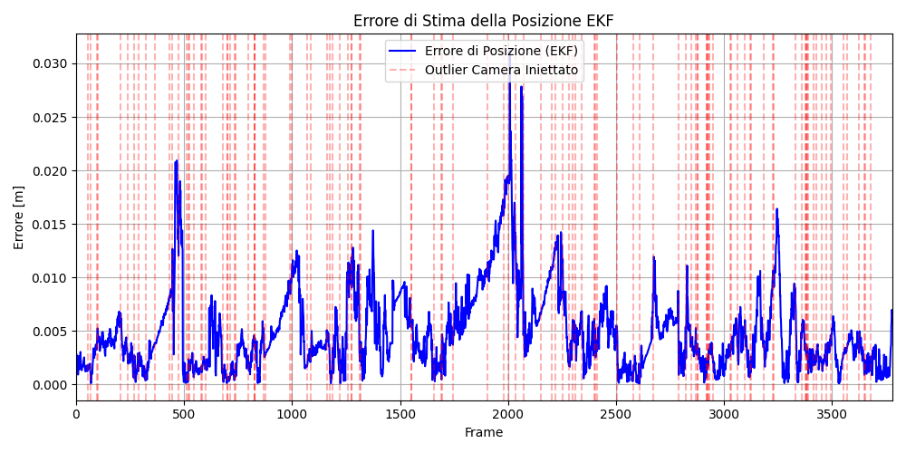



# Introduzione 

Nel campo della robotica mobile, in particolare per quanto riguarda i veicoli autonomi, esistono due problemi fondamentali e complementari:

- *Localizzazione*, la mappa dell'ambiente è già nota e l'obiettivo è determinare la posizione esatta e l'orientamento del veicolo all'interno di essa.

- *Mappatura*, la posizione del veicolo è nota a priori e l'obiettivo è esplorare l'ambiente per ricostruire una mappa accurata a partire dai dati dei sensori.

Questi due processi sono, essenzialmente, l'uno l'opposto dell'altro.
Tuttavia, negli scenari reali, un robot si trova spesso in un ambiente completamente sconosciuto, senza avere a disposizione né una mappa preesistente né una stima esatta della propria posizione. È in questa situazione che entra in gioco un terzo e più complesso problema, che consiste nell'unione dei due precedenti, lo *SLAM* (Simultaneous Localization and Mapping).

## SLAM

Lo SLAM è il processo computazionale che permette a un veicolo o a un robot di costruire una mappa di un ambiente sconosciuto mentre, contemporaneamente, calcola la propria posizione all'interno di quella stessa mappa in fase di costruzione.

Questo problema viene spesso descritto come un paradosso, per costruire una mappa precisa è necessario conoscere l'esatta posizione del veicolo, ma per stimare l'esatta posizione del veicolo serve avere una mappa di riferimento. 

Lo SLAM risolve questo paradosso fondendo in tempo reale i dati provenienti da vari sensori (come telecamere, LiDAR, radar e odometria) attraverso algoritmi probabilistici, come i Filtri di Kalman. 
In questo modo, ogni volta che il veicolo acquisisce nuove informazioni sull'ambiente, il sistema aggiorna simultaneamente sia la geometria della mappa sia la stima della posizione del veicolo al suo interno.


# Filtro di Kalman

Il *Filtro di Kalman* è un algoritmo di stima ottimale che opera in modo ricorsivo in tempo reale. Il suo scopo è stimare lo *stato* di un sistema dinamico a partire da una serie di misurazioni sensoriali che sono intrinsecamente incomplete e affette da rumore.

Il funzionamento del filtro si basa su un ciclo continuo diviso in due fasi principali:

- *Predizione*, utilizzando un modello matematico del movimento, il filtro *predice* lo stato successivo del robot e calcola il livello di incertezza di questa previsione.

- *Aggiornamento*, il filtro confronta il dato reale con quello ottenuto dalla previsione. Attraverso un coefficiente matematico chiamato Guadagno di Kalman, il filtro stabilisce quanta fiducia dare alla predizione teorica e quanta alla misurazione reale, combinandole per ottenere la stima finale.

Il Filtro di Kalman standard presuppone però che il sistema sia lineare e che sia effetto da rumore gaussiano.
Tuttavia, la maggior parte dei sistemi robotici sono non lineari e quindi non possono essere trattati dal filtro di Kalman standard.
Per affrontare questa limitazione bisogna quindi utilizzare una variante del filtro chiamata *Filtro di Kalman Esteso* (EKF), che permette di gestire sistemi non lineari linearizzando le equazioni attorno alla stima corrente dello stato.

## Filtro di Kalman esteso

Nella robotica modelli cinematici, come quello dell'uniciclo, sono governati da leggi fortemente non lineari. Per questo è stata sviluppata una variante del filtro chiamata *EKF* (Extended Kalman Filter), che permette di propagare le covarianze e calcolare il guadagno utilizzando modelli linearizzati.

L'idea fondamentale alla base dell'EKF è l'uso dell'espansione in Serie di Taylor di primo ordine calcolata attorno alla stima corrente dello stato. In pratica, l'algoritmo calcola le derivate parziali delle funzioni non lineari rispetto alle variabili di stato e di rumore. Le matrici che contengono queste derivate parziali prendono il nome di Matrici Jacobiane.

L'EKF segue la stessa struttura base del filtro di Kalman standard:

**Fase di Predizione**
Lo stato futuro del robot viene predetto usando le equazioni non lineari del moto ($f_k$), mentre l'incertezza viene propagata usando le Jacobiane del modello cinematico rispetto allo stato ($A$) e rispetto al rumore di processo ($G$).

$$
\begin{cases}
\hat{x}(k+1)^- = f_k(\hat{x}(k), u(k)) \\
P(k+1)^- = A(k)P(k)A(k)^T + G(k)Q(k)G(k)^T
\end{cases}
$$

**Fase di Aggiornamento**
Si calcola la Jacobiana del modello di misura ($H$). Successivamente si valuta la *covarianza dei residui* ($S$) e il Guadagno di Kalman ($W$) per correggere lo stato usando l'innovazione, ovvero la differenza tra la misura reale $z(k+1)$ e la misura predetta non lineare $h_{k+1}(\hat{x}(k+1)^-)$.

$$
\begin{cases}
S(k+1) = H(k+1)P(k+1)^- H(k+1)^T + R(k+1) \\
W(k+1) = P(k+1)^- H(k+1)^T S(k+1)^{-1} \\
\hat{x}(k+1) = \hat{x}(k+1)^- + W(k+1) \left( z(k+1) - h_{k+1}(\hat{x}(k+1)^-) \right) \\
P(k+1) = (I - W(k+1)H(k+1))P(k+1)^-
\end{cases}
$$

## Modello Cinematico dell’Uniciclo

Il veicolo che viene usato per la simulazione segue il modello cinematico dell'*uniciclo* che rappresenta un classico esempio di un sistema robotico non lineare e non olonomo.

### Definizione dello stato

Il modello dell'uniciclo rappresenta un veicolo che si muove su un piano bidimensionale (2D). Lo stato cinematico completo del sistema in un generico istante di tempo continuo t è descritto da un vettore di stato a 4 dimensioni:

$$
S = \begin{bmatrix} x \\ y \\ v \\ \theta \end{bmatrix}
$$

dove $x(t)$ e $y(t)$ sono le coordinate cartesiane del centro di istantanea rotazione del robot rispetto a un sistema di riferimento globale fisso, $v(t)$ è la velocità lineare di avanzamento e $\theta(t)$ è l'angolo di imbardata (heading), ovvero l'orientamento del veicolo rispetto all'asse $x$ globale.

Gli ingressi di controllo (ovvero le forze motrici virtuali) del sistema sono descritti dal vettore:

$$
u(t) = \begin{bmatrix} a(t) \\ \omega (t) \end{bmatrix}
$$

dove $a(t)$ è l'accelerazione lineare e $\omega (t)$ la velocità angolare.

### Modello cinematico

Sfruttando il vincolo appena descritto, possiamo scomporre la velocità lineare $v(t)$ sugli assi cartesiani globali. Questo ci permette di scrivere il sistema di Equazioni Differenziali Ordinarie (ODE) che governa l'evoluzione analitica del sistema nel tempo:

$$
\dot{x}(t) = f(x(t), u(t)) \rightarrow
\begin{cases}
\dot{x} = v \cos(\theta) \\
\dot{y} = v \sin(\theta) \\
\dot{v} = a \\
\dot{\theta} = \omega
\end{cases}
$$

Da questo sistema si riesce chiaramente a vedere la componente non lineare ed questa e' il motivo per cui non si puo' usare il *Filtro di Kalman Standard* ma invece bisogna usare la versione estesa del filtro il quale sfrutta le serie di Taylor per lineare queste funzioni.


# Modelli dei Sensori

Nel simulatore, l'uniciclo e' equipaggiato con due sensori:

- *IMU* 
- *Telecamera*

questa coppia rappresenta una configurazione molto comune essendo che solitamente si tende ad accoppiare sensori propriocettivi con sensori esterocettivi per ragioni che verranno trattate in seguito.

## IMU Planare

L'IMU è un sensore propriocettivo che misura accelerazioni lungo gli assi cardinali, nel caso della versioni planare le misurazioni ottenute sono:

- Accelerazione lineare lungo l'asse $x$ del robot ($a_x$).
- Accelerazione lineare lungo l'asse $y$ del robot ($a_y$).
- Velocità angolare attorno all'asse $z$ (giroscopio, $\omega$).

### Modello del rumore e implementazione

I sensori reali sono affetti da imperfezioni, quindi nella classe `IMU` della simulazione al segnale generato dal calcolo della cinematica dell'uniciclo vengono aggiunti due tipi di disturbo:

- **Rumore Gaussiano** fluttuazioni casuali a media nulla aggiunte a ogni singola lettura
- **Bias** un errore sistematico a lenta variazione temporale. Nel codice, il bias è modellato come un *Random Walk*, ovvero il bias attuale è uguale al bias precedente sommato ad un piccolo rumore gaussiano. 

```{python}
# Update bias random walk
self.bg +=  delta_t * self.rng.normal(scale=self.gyro_bias_rw_std)
self.ba +=  delta_t * self.rng.normal(scale=self.accel_bias_rw_std, size=2)

# ...

# Misure ottenute dall'IMU con aggiunta di bias e rumore bianco
gyro_z = (omega + self.bg) + self.rng.normal(scale=self.gyro_noise_std)
accel_b = (ab + self.ba) + self.rng.normal(scale=self.accel_noise_std, size=2)
```

### Problemi con sensori propriocettivi 

Conoscendo l'accelerazione di ogni asse del robot e' teoricamente ricavabile lo stato del robot semplicemente integrando l'accelerazione e poi integrando la velocita'.
Tuttavia non viene mai usata una IMU o più in generale un sensore propriocettivo, come unico sensore, perche' si puo' dimostrare che questi tipi di sensori accumulano errore.

Quindi per il caso della *IMU*:

$$
x(t) = x_0 + v_0 t + \frac{1}{2} a_m t^2 = x_0 + v_0 t + \frac{1}{2} a t^2 + \frac{1}{2} \epsilon t^2
$$
$$
\begin{align}
E(x(t)) &= E(\bar{x}(t) + \frac{1}{2} \epsilon t^2) = E(\bar{x}(t)) + E(\frac{1}{2} t^2 E(\epsilon)) \\
&= \bar{x}(t) + \frac{1}{2} t^2 E(\epsilon)
\end{align}
$$
$$
\begin{align}
E((x(t) - \bar{x}(t))^2) &= E((\frac{1}{2} \epsilon t^2)^2) = \frac{1}{4} t^4 E(\epsilon^2) \\
                        &= \frac{1}{4} t^4 E((\epsilon - E(\epsilon))^2) \\
                        &= \frac{1}{4} t^4 \sigma^2
\end{align}
$$
$$
\text{Sd} \rightarrow \sigma_x = \frac{t^2}{2} \sigma
$$

Quindi possiamo vedere chiaramente che la deviazione standard (*sd*) del sensore dipende direttamente dal tempo.
Proprio per questo motivo non vengono usati solo sensori propriocettivi ma l'aggiunta di sensori esterocettivo permettono di ottenere un riferimento con l'ambiente esterno.

## Telecamera

La *Telecamera* all'interno della simulazione viene semplificata usando il modello *pin-hole*; questa riconosce punti di riferimento posizionati all'interno dell'ambiente, chiamati *landmark*, la cui posizione nel frame world $<w>$ e' conosciuta a priori. 

### Funzionamento e Vincoli Visivi
La telecamera viene limitata in quello che vede secondo due caratteristiche che sono le seguenti:

- **Field of View (FOV):** un angolo visivo limitato
- **Range:** range di distanza per la quale la telecamera riesce a vedere i landmark

Il metodo `check_fov()` si assicura che solo i landmark che rientrano in queste limitazioni geometriche generino una misurazione valida.

### Proiezione e Utilizzo nell'EKF (Fase di Aggiornamento)
Quando un landmark è visibile, la sua posizione reale nel mondo ($l_w$) viene trasformata nelle coordinate locali del robot (Body frame, $l_b$) tramite la matrice di rotazione inversa $R_{BW}$. 
Successivamente, per simulare la formazione dell'immagine sul sensore ottico, le coordinate vengono normalizzate rispetto alla profondità $x$ (coordinate omogenee) e moltiplicate per i parametri intrinseci della telecamera, ottenendo una coordinata in pixel $u$ affetta da rumore gaussiano.

Nel file `kalman_filter.py`, la fase di *Aggiornamento* utilizza queste letture in pixel per correggere lo stato. Il metodo `measurement_model()` replica esattamente la matematica della proiezione ottica per calcolare la misura attesa $\hat{z}$. Nello stesso momento, la funzione `measurement_jacobian()` calcola la matrice $H$, applicando la regola della catena delle derivate (Chain Rule):

$$
H = \frac{\partial u}{\partial \tilde{l}_b} \cdot \frac{\partial \tilde{l}_b}{\partial l_b} \cdot \frac{\partial l_b}{\partial x}
$$

Questa matrice $H$ è fondamentale per calcolare l'Incertezza dell'Innovazione $S$ e il Guadagno di Kalman $W$, chiudendo così il ciclo dell'algoritmo ricorsivo e permettendo al sistema di gestire gli outlier tramite i calcoli della Distanza di Mahalanobis.

# Gestione degli Outliers 

Il filtro di Kalman, pur essendo uno stimatore ideale e' sempre soggetto a misurazioni anomale. Un singolo dato errato in fase di aggiornamento puo' invalidare la stima dello stato e le matrici di covarianza, portando il filtro a sbagliare.
Per questo e' fondamentale inserire dopo le misure ottenute un qualche tipo di filtro che permetta di riconoscere e scartare le misurazioni ritenute incorrette.

## La Distanza di Mahalanobis

Per risolvere il problema appena citato, il filtro degli outlier si basa sulla *Distanza di Mahalanobis*.

Data una misurazione $z$, un valore medio atteso $\mu$ e una matrice di covarianza $\Sigma$ che descrive l'incertezza, la distanza di Mahalanobis al quadrato $D^2$ è definita come:

$$
D^2 = (z - \mu)^T \Sigma^{-1} (z - \mu)
$$

Da queste equazioni si evince il comportamento del filtro:
- Se l'incertezza $\Sigma$ è piccola, anche un piccolo scostamento $(z - \mu)$ genererà un $D^2$ molto grande rendendo il filtro meno tollerante.
- Se l'incertezza $\Sigma$ è grande, il termine $\Sigma^{-1}$ rende il filtro più tollerante.

## Il Test del Chi-Quadro ($\chi^2$)

Sotto l'assunzione che il rumore del sistema sia bianvo, la variabile statistica $D^2$ segue una distribuzione del *Chi-Quadro* ($\chi^2$) con un numero di gradi di libertà pari alla dimensionalità della misurazione.

Il filtro degli outlier funziona impostando un *livello di confidenza* (es. 95% o 99%). Tramite le tabelle statistiche della distribuzione $\chi^2$, si ricava un valore di soglia. 
Il processo decisionale è quindi un semplice test d'ipotesi:

1. Se $D^2 \leq \text{soglia}$, il dato appartiene statisticamente alla distribuzione attesa. Viene accettato.
2. Se $D^2 > \text{soglia}$, il dato è statisticamente troppo improbabile. Viene classificato come outlier e rigettato.

## Nella IMU

Nel caso della IMU, il filtro degli outlier mantiene una finestra mobile di misurazioni recenti. Per ogni nuova lettura, calcola la media e la covarianza della finestra, e poi valuta la distanza di Mahalanobis della nuova misura rispetto a questa distribuzione.


```{python}
# Calcolo della statistica sulla finestra mobile
history_array = np.array(self.history)
mu = np.mean(history_array, axis=0)  
Sigma = np.cov(history_array, rowvar=False)

# Calcolo della distanza di Mahalanobis
diff = z - mu
mahalanobis_sq = diff.T @ np.linalg.inv(Sigma) @ diff

if mahalanobis_sq > self.chi2_threshold:
  # Dato invalido
  self.outlier_detected = True
  print(f"[Outlier Rejector] Outlier rilevato! D^2: {mahalanobis_sq:.2f} > Soglia: {self.chi2_threshold:.2f}")

  return mu.reshape((3,1))
    
else:
  # Dato valido
  self.outlier_detected = False
  self.history.pop(0)
  self.history.append(z)
  return measurement
```

## Nella Camera

A differenza dell'IMU, che basa il filtraggio su una statistica ricavata da una finestra temporale di misurazioni passate, il rigetto degli outlier per la telecamera utilizza un approccio molto più robusto e reattivo basato direttamente sull'architettura predittiva del Filtro di Kalman Esteso. Questo metodo valuta l'errore non in modo assoluto, ma pesandolo rispetto all'incertezza stimata dal filtro in quel preciso istante.

Il concetto matematico chiave in questa fase è l'**Innovazione** (o residuo), definita come la differenza tra la misurazione reale $z$ ottenuta dal sensore e la misurazione attesa $\hat{z}$. Quest'ultima viene calcolata proiettando lo stato predetto del robot nel dominio ottico del sensore tramite il modello di misura $h(x)$.

Per implementare questo controllo in modo sicuro, la classe esegue un'operazione di "anticipazione" delle formule dell'EKF prima di procedere al vero aggiornamento dello stato:

1. **Predizione dello Stato e della Covarianza**, l'algoritmo calcola in anticipo lo stato predetto a priori $\hat{x}^-$ e propaga la matrice di covarianza dell'errore $P^-$.
2. **Calcolo della Covarianza dell'Innovazione ($S$)**, non ha senso valutare l'errore $(z - \hat{z})$ senza conoscere l'incertezza associata a quella previsione. Utilizzando la Matrice Jacobiana $H$, calcolata nel punto di predizione, il filtro proietta l'incertezza dello stato nello spazio delle misurazioni (i pixel) e le somma il rumore intrinseco del sensore $R$. La formula applicata è:
$$
S = H P^- H^T + R
$$
Questa matrice $S$ rappresenta, in termini statistici, la covarianza dei residui, ovvero quanto "siamo insicuri" riguardo alla misurazione che stiamo per ricevere.
3. **Calcolo della Distanza e Reiezione:** Avendo a disposizione l'innovazione e la sua incertezza $S$, si calcola la Distanza di Mahalanobis. Poiché nel nostro simulatore la telecamera semplificata rileva la posizione del landmark come coordinata pixel lungo una singola dimensione ottica, i gradi di libertà del test sono pari a 1. Di conseguenza, la matrice $S$ è uno scalare e la distanza di Mahalanobis collassa in un semplice rapporto quadratico:
$$
D^2 = \frac{(z - \hat{z})^2}{S}
$$
Se questo scostamento supera la soglia statistica dettata dalla distribuzione $\chi^2$, la misurazione del landmark è considerata fisicamente implausibile (ad esempio un riflesso o un falso rilevamento visivo). Il dato viene quindi classificato come outlier e scartato *prima* che il suo valore possa corrompere le matrici di stima dell'EKF.


```{python}
# Anticipazione della fase di predizione dell'EKF
pred_state = ekf.state + ekf.d_state * delta_t
pred_state[4, 0] = (pred_state[4, 0] + np.pi) % (2 * np.pi) - np.pi
pred_P = ekf.P + ekf.P_dot * delta_t

for lm, z_true in zip(camera_measurements['landmarks'], camera_measurements['pixels']):
    
    # Misurazione attesa e Jacobiano (H) proiettati dal modello interno dell'EKF
    z_pred, H_i = ekf.measurement_model(pred_state, lm)
    
    # Covarianza dell'innovazione (S) incertezza dello stato + rumore del sensore
    S_i = H_i @ pred_P @ H_i.T + ekf.R
    S_i_scalar = float(np.squeeze(S_i))
    
    # Calcolo della Distanza di Mahalanobis 
    diff = float(z_true - z_pred)
    mahalanobis_sq = (diff ** 2) / S_i_scalar
    
    # Confronto con la soglia del Chi-Quadro
    if mahalanobis_sq <= self.chi2_threshold:
        filtered_landmarks.append(lm)
        filtered_pixels.append(z_true)
    else:
        # Il dato viene ignorato e non inviato alla fase di aggiornamento dell'EKF
        self.outliers_rejected_count += 1
```

# Risultati e Validazione Sperimentale

Per dimostrare l'effettiva robustezza dell'algoritmo sviluppato, la simulazione è stata testata iniettando deliberatamente degli errori artificiali (outlier) all'interno delle misurazioni dei sensori. I risultati seguenti mostrano il comportamento del sistema di rilevamento e la resilienza del Filtro di Kalman Esteso.

## Efficacia della Reiezione sull'IMU

Come si evince dal grafico, l'algoritmo basato sulla finestra mobile statistica ha identificato con successo le anomalie. C'è una corrispondenza esatta tra gli spike generati dal simulatore e quelli isolati dal filtro. Rigettando questi picchi e sostituendoli con il valore medio atteso, il filtro ha evitato che l'integrazione di accelerazioni irreali portasse a una deriva immediata della posizione stimata.




## Resilienza dell'EKF alle Anomalie Visive

Il grafico seguente traccia l'errore assoluto di stima della posizione nel tempo. Le linee verticali rosse indicano gli istanti in cui sono stati iniettati gli outlier visivi. È fondamentale notare come l'errore di posizione dell'EKF rimanga limitato e stabile, senza subire aumenti significativi in corrispondenza dei dati anomali. 



# Conclusioni

In questo progetto, l'obiettivo principale è stato quello di progettare e implementare un Filtro di Kalman Esteso (EKF) all'interno di un ambiente di simulazione per stimare in modo robusto lo stato dell'uniciclo, integrandolo con un sistema per la gestione e la reiezione degli outlier.

Durante lo sviluppo e l'analisi del progetto sono state esplorate e affrontate diverse tematiche fondamentali della robotica probabilistica:

- **La necessità della Fusione Sensoriale (Sensor Fusion):** Si è dimostrato analiticamente e sperimentalmente il motivo per cui l'affidamento esclusivo a sensori propriocettivi (come l'IMU) sia insufficiente per una navigazione sicura a lungo termine. A causa della natura integrativa di questi sensori, l'errore quadratico si accumula inesorabilmente nel tempo portando a una deriva della stima. Per compensare questo fenomeno, si è resa necessaria la fusione con sensori esterocettivi (come la telecamera). Nonostante quest'ultimi comportino un maggiore costo e una superiore complessità a livello implementativo.

- **Gestione della Non Linearità**, data la forte non linearità del modello cinematico dell'uniciclo e dei modelli di osservazione ottica, si è reso necessario l'utilizzo del Filtro di Kalman Esteso (EKF). Attraverso il calcolo delle Matrici Jacobiane del modello cinematico e di misura, il sistema è in grado di linearizzare localmente il problema, permettendo di propagare correttamente le covarianze dell'errore ad ogni passo temporale.

- **Gestione degli Outlier tramite Distanza di Mahalanobis**, il cuore innovativo del progetto è stato lo sviluppo di un filtro adattivo per le misurazioni anomale, essenziale poiché un singolo dato fortemente corrotto potrebbe far divergere irreparabilmente l'EKF. Il sistema implementato sfrutta la Distanza di Mahalanobis e il test statistico del Chi-Quadro ($\chi^2$), declinandoli in due strategie distinte per adattarsi alla natura dei sensori:
  - *Per l'IMU:* è stato adottato un approccio statistico locale a *finestra mobile*, capace di identificare e rigettare spike impulsivi ad alta frequenza, distinguendoli dalle manovre volontarie del robot.
  - *Per la Telecamera:* si è sfruttata direttamente l'architettura predittiva dell'EKF. Pesando l'errore visivo con la matrice di covarianza ($S$), il sistema riesce a scartare misurazioni statisticamente implausibili *prima* che queste possano compromettere la delicata fase di aggiornamento dello stato.

Come evidenziato nella sezione dei risultati, i test condotti iniettando deliberatamente rumore anomalo (sia spike accelerometrici che false letture visive) hanno confermato l'assoluta resilienza del sistema. Il filtro ha scartato con successo le anomalie senza generare falsi negativi, permettendo all'EKF di proseguire la navigazione con un errore confinato a pochi centimetri.
